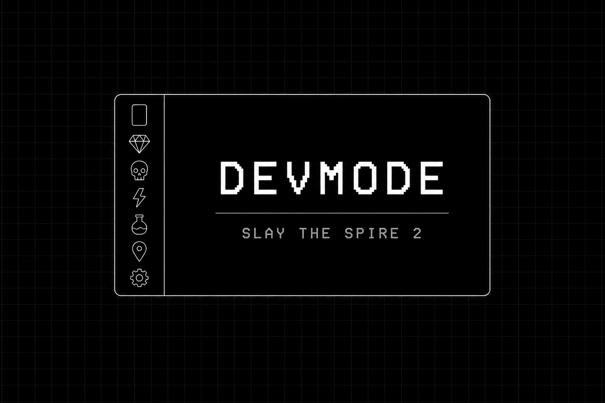

# DevMode

[English](./README.md) | **中文**

适用于《杀戮尖塔 2》的开发者模式模组。



## 功能特性

- 主菜单与对局内均可访问的开发者面板
- 可配置遗物、卡牌、金币与遭遇，便于搭建可重复测试流程
- 敌人遭遇战系统，含统一选择界面、战斗怪物生成及待机动画预览
- 支持热重载的 SpireScratch 脚本运行器、事件钩子与游戏内日志查看器
- 国际化支持，提供英文与简体中文本地化
- 可扩展面板注册机制 — 其他 mod 可向 DevMode 轨道添加自定义标签页

## 扩展 DevMode

其他 mod 可通过 `DevPanelRegistry` 注册自定义轨道标签。完整 API 说明、代码示例与图标用法见 **[开发者 → 开发者面板注册](docs/pages/developer/extending/panel-registry.md)**。

## 文档站点

**[docs/](docs/)** 为 **[Valaxy](https://valaxy.site/)** 文档站。请使用 **pnpm**（推荐用 Corepack 固定版本）：

```bash
cd docs
corepack enable && corepack prepare pnpm@10.24.0 --activate
pnpm install && pnpm dev
```

## 协作与贡献

协作流程、K&R 代码风格、`dotnet format` / `make format`、Python 与本地化等说明见 **[CONTRIBUTING.md](CONTRIBUTING.md)**。

## 更新日志

版本历史请参阅 [CHANGELOG.zh-CN.md](CHANGELOG.zh-CN.md)。

## 致谢

- [STS2-KaylaMod](https://github.com/mugongzi520/STS2-KaylaMod)

## 许可证

MIT
