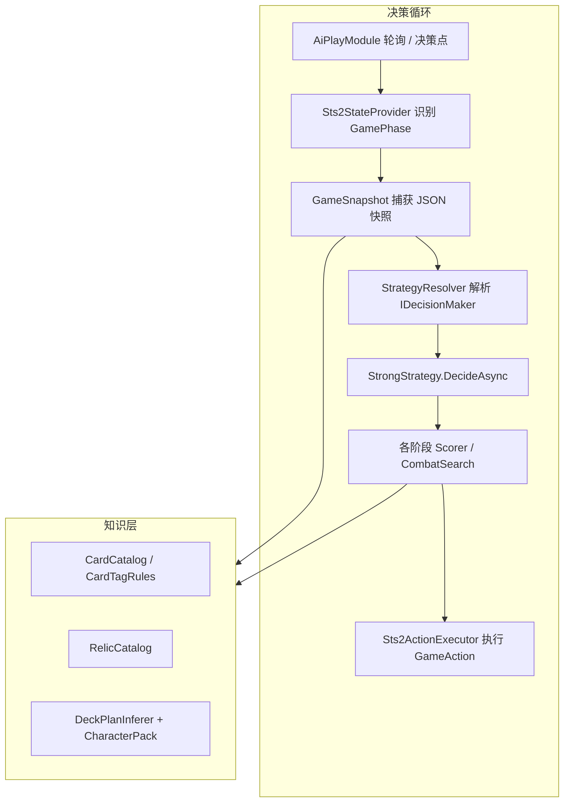

# Solo AI 算法（StrongStrategy）

DevMode **AI Host → AutoPlay** 默认使用 `StrongStrategy`（设置项 `AutoPlayStrategy: Strong`）。这是一套纯规则、无 LLM 的单机自动化决策管线，目标是在 A10 左右具备可玩的宏观路线与战斗表现。

相关代码：`src/AI/` · 回归脚本：`tools/ai-bench/` · Mod 扩展说明：[README.md § Mod AI integration](../README.md#mod-ai-integration)

---

## 总览



| 层级 | 职责 | 主要类型 |
| --- | --- | --- |
| 循环 | 轮询当前阶段、触发决策、写 `AiDecisionLog` | `AiPlayModule`, `GameLoop` |
| 快照 | 把 Run / 战斗 / UI 状态序列化为 `JsonObject` | `GameSnapshot`, `GameSnapshotPhaseCapture` |
| 规划 | 根据牌组 / 遗物 / 层数推断「想要什么牌」 | `DeckPlanInferer`, `DeckPlan` |
| 评分 | 各阶段选最优 `GameAction` | `*Scorer`, `CombatScorer` |
| 战斗搜索 | 浅层模拟 + 斩杀检测 | `CombatSearch`, `LethalChecker` |
| 执行 | 点击 UI / 出牌 / 购货 | `Sts2ActionExecutor` |

**策略解析顺序**（Companion / 多人场景同样适用）：`netId` 注册表 → 角色 `CharacterAiRegistry` → 默认 `StrongStrategy`（`AutoPlayStrategy=Simple` 时回退 `SimpleStrategy`）。

---

## 决策循环

1. 单机 Run 开始且 `AutoPlayEnabled=true` 时，`AiPlayModule` 启动 `GameLoop`。
2. 每 `PollIntervalMs` 轮询一次当前 `GamePhase`；Harmony patch 也会在决策点调用 `OnDecisionPoint`。
3. `Sts2StateProvider` 调用 `GameSnapshot.Capture`，再经 `GameSnapshotPhaseCapture.Enrich` 补充 overlay 数据。
4. `IDecisionMaker.DecideAsync` 返回 `GameAction`（含 `Type`、`TargetIndex`、`Reason`）。
5. `Sts2ActionExecutor` 执行动作；`Reason` 写入日志，便于复盘。

多人 hand-play 时 AutoPlay **自动关闭**；LAN / Pseudo Co-op 走独立队列，见 [lan-host-drive-afk.md](./lan-host-drive-afk.md)。

---

## 快照字段（StrongStrategy 依赖）

### 全局

| 字段 | 含义 |
| --- | --- |
| `totalFloor`, `actIndex`, `actFloor` | 层数 / Act |
| `gold`, `currentHp`, `maxHp` | 经济与健康 |
| `characterId`, `ascensionLevel` | 角色与进阶 |
| `deck[]` | 牌组（id、name、rarity、cost、keywords、upgradeLevel） |
| `relics[]` | 已拥有遗物 |
| `potions[]` | 药水 id |

### 战斗 `combat`

| 字段 | 含义 |
| --- | --- |
| `currentEnergy` | 当前能量 |
| `playerBlock` | 玩家格挡 |
| `hand[]` | 手牌（canPlay、cost、damage、block、targetType） |
| `enemies[]` | 敌人 HP、block、intentDamage、intentBlock、isAlive |

### 阶段扩展（`GameSnapshotPhaseCapture`）

| 字段 | 阶段 | 含义 |
| --- | --- | --- |
| `offeredCards[]` | CardReward | 奖励 / 选牌界面上的卡 |
| `deckSelectContext` | CardReward | `"reward"` / `"upgrade"` / `"remove"` / `"deckPick"` |
| `offeredRelics[]` | RelicSelection | 可选遗物 |
| `shopOffers[]` | Shop | card / relic / potion / removeCard |
| `restOptions[]` | RestSite | 休息选项按钮 |
| `restProceedReady` | RestSite | Proceed 是否可点（选完 heal/smith 后离开） |
| `mapNodes[]` | MapSelection | 可选地图节点 |
| `eventOptions[]`, `eventId` | EventChoice | 事件选项 |

Mod 扩展写入 `snapshot["extensions"][yourKey]`，StrongStrategy **不会**读取 mod 专有字段，需注册自定义 `IDecisionMaker` 或 `IAiMoveModifier`。

---

## DeckPlan（牌组规划向量）

`DeckPlanInferer.Infer(snapshot)` 在每次宏观决策前构建规划，供所有 Scorer 共用。

### 输出

| 属性 | 默认 | 说明 |
| --- | --- | --- |
| `TargetDeckSize` | 18 | 理想牌组大小 |
| `ThinPreference` | 动态 ∈ [-0.3, 1] | 删牌 / 跳过奖励的倾向 |
| `Weights[AiTag]` | 见下 | 各语义 tag 权重 |

### 基础权重（推断起点）

- `Attack` +1.0，`Block` +0.8，`Draw` +0.6
- 牌组含 ≥3 张 Exhaust 卡或 Exhaust 遗物 → `Exhaust` +1.2
- A7+ → `Block` +0.4；A10+ → `Attack` +0.3

### ThinPreference 调整

| 条件 | 调整 |
| --- | --- |
| 牌组 >18 且抽牌 tag 卡 <2 | +0.35 |
| 牌组 > TargetDeckSize+4 | +0.25 |
| 拥有 Thin 类遗物 | +0.2 |
| Act1 且 floor<15 | -0.15（早期略厚） |
| Act3+ 且牌组 >22 | +0.30 |

最后调用 `DeckPlanContributorHub`：原版五角色在 `src/AI/Characters/Vanilla/*Pack.cs` 注册额外权重与 `TargetDeckSize`（Silent/Defect 15、Ironclad 17、Necrobinder/Regent 16）。

### CodexPriorCatalog（社区 prior，可选）

离线从 [Spire Codex](https://spire-codex.com/runs) A10 宏观样本训练（`tools/codex-train/` → 嵌入 `src/AI/Data/codex-priors.json`）。启动时由 `AiKnowledgeBootstrap` 加载；**不替代**规则层，只在各 `*Scorer` 上叠加有界 bonus（±15，× `CodexPriorWeight`，默认 1，settings.json 可调 0 关闭）。

| 表 | 用途 | 接入点 |
| --- | --- | --- |
| `cards` | 选牌 pick_rate / bonus | `MacroScorerHelper.ScoreCardOffer` |
| `skip` | skip 阈值偏移 | `CardRewardScorer.SkipScore` |
| `rest` | HEAL/SMITH/LIFT 偏好 | `RestScorer`（HP 45–85% 区间） |
| `remove` | 常删牌 bonus | `ShopScorer`、`DeckSelectScorer` |
| `relics` | 遗物 pick bonus（`event` / `combat_reward` / `shop` context） | `MacroScorerHelper.ScoreRelicOffer` |
| `events` | Neow / 事件选项 pick bonus | `EventChoiceScorer` via `GetEventOptionBonus` |

`NormalizeContext` 支持 `shop`、`event`、`combat_reward`（此前 `event` 被误映射为 `combat_reward`，已修复）。

重训流程：`tools/codex-crawl export-parquet` → `uv run codex-train --parquet ../codex-crawl/data/macro_samples.parquet train` → `dotnet build`。

Holdout（v1，4944 runs）：card_choice top-1 **56.7%**（随机 33%）；rest **60.4%**。

### 辅助公式

```
ScoreTags(tags, plan) = Σ plan.GetWeight(tag)
DilutionPenalty(deckSize, plan) = max(0, deckSize - TargetDeckSize) × ThinPreference × 0.8
```

---

## DeckEvaluator（牌组质量与删牌边际收益）

`DeckEvaluator.Evaluate(snapshot, plan)` 是删牌 / skip / 选牌删谁 的**单一真相源**（`src/AI/Planning/DeckEvaluator.cs`）。

### DeckMetrics

| 字段 | 含义 |
| --- | --- |
| `MeanValue` | 牌组内单卡均分 |
| `WorstValue` / `WorstCardName` | 最低分卡（删牌首选） |
| `RemovalUplift` | 删最差卡的边际收益 |
| `StarterBloat` | Strike/Defend/Curse 冗余度 |
| `ConsistencyScore` | 一致性 0..1 |

### 单卡价值 ScoreInDeck（`DeckCardScoring`）

已在牌组内的卡，**不含** dilution 项，但含冗余惩罚：

| 因素 | 逻辑 |
| --- | --- |
| 基础 | ScoreTags + RarityScore + 0费/高费/已升级 |
| 诅咒 | −40 |
| Strike 冗余 | 每张 −15×max(0, strikeCount−1)，**与 deckSize 无关** |
| Defend 冗余 | 每张 −12×max(0, defendCount−1) |
| Starter 且 tag 分低 | −10 |
| 0 费且 tag 分低 | −5 |

### RemovalUplift

```
RemovalUplift = (MeanValue - WorstValue)
              + StarterBloat × 4
              + round(DilutionPenalty(deckSize))
              + FutureThinBonus(actIndex, floor)
```

- `StarterBloat`：Strike>2 计超出部分；Defend>2 计超出×0.8；每张诅咒 +3
- `FutureThinBonus`：Act1 +5/+3，Act2 +2，Act3 +0（越早删，长期收益越高）
- **门槛**：`RemovalUplift < MinRemovalUplift(11)` 时不买商店删牌（**无 deckSize 硬门槛**）

**示例**：12 张牌、4 Strike、均分 14、最差 Strike 值 2 → uplift ≈ (14−2)+8+future ≈ 24，小卡组仍会删 Strike。

---

## 知识层：Tag 与 Catalog

### AiTag 枚举

`Attack`, `Block`, `Draw`, `Exhaust`, `Scaling`, `Thin`, `Energy`, `Aoe`, `Setup`, `Utility`

### CardCatalog

- 启动时在 `ModelDb.Init` 之后索引全卡（`AiKnowledgeBootstrap` + `ModelDbInitPatch`）。
- `CardTagRules` 从 **卡 id 前缀**、**CardType**、**CardKeyword**（Exhaust/Retain 等）推断 tag，避免逐卡硬编码。
- `CardMechanicIndex` + `OfficialMechanicProbe`：CardKeyword / DynamicVars / 类型图 / LocString key / 字段引用 → `CardMechanicFlags`；`DeckSynergyEvaluator` 按机制类型算 deck 协同；**仅无结构信号时**才用英文描述 fallback。
- Mod 可通过 `ICardTagProvider` 合并额外 tag。

### RelicCatalog / RelicMechanicIndex

- 从遗物 id 推断 tag（如 Exhaust、Thin），用于 `DeckPlanInferer` 与遗物评分。
- `RelicMechanicIndex` 通过 `OfficialMechanicProbe` 解析 `RelicModel` 结构与 loc key（如 `HeftyTablet` → 稀有三选一 + Injury）；描述文本为最后兜底。

---

## StrongStrategy 阶段路由

| GamePhase | 决策器 | 动作类型 |
| --- | --- | --- |
| Combat | `PotionScorer` → `CombatSearch` → `CombatScorer` | UsePotion / PlayCard / EndTurn |
| MapSelection | `MapScorer` → `MapPathPlanner` | SelectMapNode |
| CardReward | `DeckSelectScorer` | PickCardReward / SkipCardReward |
| RelicSelection | `RelicScorer` | PickRelic |
| Shop | `ShopScorer` | PurchaseShopItem / RemoveCardAtShop / LeaveShop |
| RestSite | `RestScorer` | Rest / UpgradeCard / Proceed |
| EventChoice | `EventChoiceScorer` | SelectEventChoice |
| RewardScreen | 固定 | CollectReward |
| PostCombatTransition | 固定 | Proceed |
| TreasureRoom | 固定 | HandleTreasureRoom |

---

## 宏观评分器

### CardRewardScorer（战斗后三选一）

用于 `deckSelectContext == "reward"`。

**单卡得分**（`MacroScorerHelper.ScoreCardOffer`）：

```
score = round(ScoreTags) + RarityScore
      + (0费 +8) + (≥3费 -3) + (已升级 +5)
      - round(DilutionPenalty(deckSize+1))
```

**RarityScore**：Ancient 30 · Rare 25 · Uncommon 15 · Common 8 · Starter 3 · Event 12

**跳过逻辑**（引用 `DeckMetrics`）：

- `MinPickScore = 9`
- `skipScore = DilutionPenalty + ThinPreference×14` + 后期加厚惩罚
- 牌组已成型：`StarterBloat≤0` 且 `MeanValue≥12` → +10 skip；`RemovalUplift<11` 且 `MeanValue≥10` → +8 skip
- 仍有多余 Strike/Defend（`StarterBloat≥3`）→ −8 skip（倾向拿好卡或去商店删）
- 若 `bestScore < max(MinPickScore, skipScore)` → `SkipCardReward`

### DeckSelectScorer（休息 smith / 商店删牌）

由 `deckSelectContext` 分流：

| context | 行为 |
| --- | --- |
| `upgrade` | 选 `ScoreInDeck` 最高、未升满的卡 |
| `remove` | 选 `ScoreInDeck` **最低**的卡（与 DeckEvaluator 同一套评分） |
| 其他 | 委托 `CardRewardScorer` |

### ShopScorer

**约束**：购物后至少保留 `MinGoldAfterShopping = 25` 金币。

**删牌分**（边际对比，非牌数门槛）：

```
removeScore = RemovalUplift - cost/4 - OpportunityCost + 金币充裕加成
```

- `RemovalUplift < 11` → 不删
- `OpportunityCost`：Act3 或 gold 紧张时额外扣分（留金给后续商店）
- 日志示例：`Remove [Strike] uplift=28 score=24 vs buy=relic(22)`

**购买分**：

- card → `ScoreCardOffer − cost/8`
- relic → `ScoreRelicOffer − cost/12`
- potion → `10 − cost/25`

**决策**：若 `removeScore > 0` 且 `removeScore ≥ bestPurchaseScore` → 删牌；否则买最高分商品；都不值得 → `LeaveShop`。

购买 `TargetIndex` 与快照一致：**仅计 card/relic/potion 顺序**，不含 removal slot。

### RestScorer

1. **`restProceedReady`** 或 **无 rest 选项** → 立即 `Proceed` 离开。
2. **heal 已消耗**（`healIdx < 0`）→ 仅 HP≥75% 且有升级目标时 smith，否则 `Proceed`（避免 heal 后 poll 误触 SMITH）。
3. 否则按 HP、路径与选项 id：
   - HP <55%，或 HP <70% 且 planner 下一步为 Elite → heal
   - Codex rest prior（HP 45–85%）；若 prior 为 SMITH 且 HP<75% 且下一步 Elite → 跳过 prior
   - HP≥75% 且无 Elite  ahead → smith（有升级目标）
   - HP <75% → heal
   - 否则 smith 或 Proceed

`TargetIndex` 为休息站按钮在 UI 中的**绝对索引**（与快照 `restOptions[].index` 对齐）。

### RelicScorer

```
score = RarityScore + Σ(plan.GetWeight(tag) × 3) + CodexRelicBonus(context)
```

已拥有同名/id → −100。`context` 来自快照 `relicChoiceContext`（EventRoom → `event`，Boss/精英 → `combat_reward`），同一遗物在 event/combat 下 Codex bonus 可不同。

### MapPathPlanner（Act 全程路径 + 画线）

替代原单步贪心 `MapScorer`：对 `RunState.Map` 做 **Boss 后向 DP**（DAG 拓扑序 O(V+E)），选「当前 → Boss 总分最高」路径上的下一步。

**文献依据**：STS 地图为 DAG，MIT 15.053 最长路径 DP；Bazzaz & Cooper (FDG 2025) 路径枚举；Miles Oram macro 三要素 flexibility/safety/resource。

**算法**：

```
bestToBoss(p) = nodeScore(p, ctx) + max_{c ∈ children} ( edgeBonus(p,c) + bestToBoss(c) )
```

- `ctx` = `MapRouteContext`（HP、gold、DeckPlan、DeckMetrics、WantsShopRemoval）
- 决策：从当前位置选 `argmax bestToBoss(child)`；日志 `path=Rest→Shop→M→…`

**MapNodeWeightScorer 节点分（动态）**：

| 类型 | 逻辑 |
| --- | --- |
| RestSite | 低 HP 高；成型牌组低 |
| Shop | `RemovalUplift≥11` + gold → 高；`StarterBloat` 高 → 高 |
| Elite | 高 HP + 高 MeanValue → 高；低 HP / A7+ → 负；Act1 floor 6–9 且 HP<75% → −15 |
| Monster | baseline；缺金略升 |
| Treasure | +20 |
| Unknown | Monster×0.7 + Event×0.3 期望 |
| Ancient | 同 Unknown |

**邻接边加成**：Rest→Elite（低 HP **−10**）；Shop→*（需删牌 +6）；Elite→Elite（低 HP −12）；Rest→Rest −5；Treasure→Elite +4。

**MapScorer**：委托 `MapPathPlanner`；无 run 数据时 greedy fallback。

**地图画线**（仅 `AutoPlayEnabled` + loop 运行中）：

- 打开地图：`MapPathPlanner.Plan` + `MapPathOverlay` 将规划边染为金色
- 关闭地图：恢复 path dot 原色；`MapPathPlanner.ClearCache`

源码：`MapPathPlanner.cs`、`MapNodeWeightScorer.cs`、`MapPathOverlay.cs`

### EventChoiceScorer

- 识别 Neow（`eventId` 或 option `textKey` 含 NEOW）。
- 快照 `eventOptions[]` 含 `optionKey`（`EventOptionInfer`：textKey/modelId/中文标题）。
- 评分：`keyword baseline` + `GetEventOptionBonus`（无 event prior 时 fallback `GetRelicBonus`）+ **`DeckSynergyEvaluator` 机制分**（遗物/卡选项）。
- 当 event prior `n≥20` 时 Codex 权重 ×1.5（`codex_primary` 模式，keyword 降为 baseline 10）。
- Reason 日志：`Neow pick [title] score=N key=HEFTY_TABLET codex=+4 synergy=+12 codex_primary`。
- 普通事件同样接 `GetEventOptionBonus`；无 prior 时保留关键词兜底。

---

## 战斗决策

### 顺序

```
DecideCombat:
  1. PotionScorer.TryUsePotion  → 有则 UsePotion
  2. CombatSearch.PickBestMove  → 浅层搜索
  3. CombatScorer.PickBestCombatMove → 单步启发式
  4. EndTurn
```

### PotionScorer（仅战斗，按药水 id 子串）

| 优先级 | 条件 | 匹配 id |
| --- | --- | --- |
| 治疗 | HP 比例 <35% | BLOOD, HEAL, FRUIT, REGEN, FAIRY |
| 保命挡 | 净伤害 ≥ 当前 HP | BLOCK, SMOKE, SOLUTION, ARMOR, SHIELD |
| AOE | ≥2 敌人且 incoming≥15 | EXPLOSIVE |
| 重挡 | NeedsBlock 且 incoming≥20 | 挡伤类 |
| 中挡 | NeedsBlock 且 HP<50% 且 incoming≥12 | 挡伤类 |

### IntentCalculator

```
TotalIncomingDamage = Σ 存活敌人 intentDamage
NetDamageAfterBlock = max(0, incoming − playerBlock)
EstimateStatusDamage = Σ playerPowers（BURN/POISON/INFEST/DOOM 的 amount）
NeedsBlock = false 当 net≤0，或 CanLethal，或 CanRaceKill（手牌 maxDamage ≥ 有攻击意图敌人的 hp+block）
否则 net ≥ max(12, effectiveHp×0.25) 或 net ≥ effectiveHp−10（effectiveHp = currentHp − statusDamage）
```

### CombatScorer（单步）

对每张可打出、能量足够的牌生成 `(PlayCard, score)`；对需选目标的 Attack 枚举敌人索引。

**出牌分（概要）**：

| 情况 | 加分 |
| --- | --- |
| NeedsBlock 且 Skill/有 block（非可斩杀） | 20 + min(block, netIncoming)；incoming≥15 再 +10；过度挡 penalize |
| !NeedsBlock 或 CanLethal 时的挡牌 | −40 |
| 低 HP 且 Skill 且 NeedsBlock | +15 |
| 自损牌（HEMOKINESIS 等）且 HP<65% | −30 |
| Attack | 20 + cost×5 + damage + 目标加成（残血敌 +30）；CanLethal +25 |
| Skill | 15 + cost×2 +（NeedsBlock 时 block/2） |
| AOE / 多敌 Attack | +12 / +15；多敌无谓 Defend −20 |
| 高费 | −(cost−1)×2 |

**EndTurn** 基础分 −10；NeedsBlock 且 incoming>0 再 −15。

Mod 可通过 `IAiMoveModifier.ModifyScore` 调整任意 move 分数。

### LethalChecker

对每个存活敌人：若 `EstimateMaxDamage(手牌, 能量)` ≥ `hp + block`，判定可斩杀并返回 targetIndex。`EstimateMaxDamage` 按伤害降序贪心消耗能量（含 id 猜测伤害）。

### CombatSearch（浅层搜索）

| 参数 | 值 |
| --- | --- |
| 时间预算 | 80 ms |
| 最大深度 | 2 张牌 |

1. 先尝试 `LethalChecker` → 直接出第一张可用 Attack 指向斩杀目标。
2. 对每个根节点 `PlayCard`：`SimulateAfterPlay`（扣能量、移除手牌、简化伤害/block）→ 再评一手 follow-up → `leafScore = rootScore + max(followUp)/2 + EvaluateLeaf`。
3. `EvaluateLeaf`：偏向高 HP、低 netDamage/statusDamage、低敌人总 HP；存活敌数 ×5 惩罚。
4. 时间允许时对最优首牌再试第二张 refinement。

`SimulateAfterPlay` 对 AOE/AllEnemy 攻击对所有存活敌人扣血；仍不模拟抽牌与复杂 powers。

---

## GameLoop poll 去重

`AiPlayModule` 每 500ms 轮询当前 phase；`GameLoop` 在决策前：

- **Combat** 且 `isPlayPhaseActive=false` → 跳过（等敌方回合/动画）；`Sts2StateProvider` 在 `CombatManager.IsInProgress` 时仍返回 `Combat`（避免敌方回合误判为 `Unknown` → `AdvanceOverlay` 刷屏）
- **快照含 combat 段** 时，`ShouldSkipCombatPoll` 与出牌后 fingerprint 等待同样生效（兜底）
- **EndTurn 已提交**（`_endTurnPending`）→ 跳过，直到 phase 变化或 play phase 结束
- **PlayCard / UsePotion 后**（`_awaitingCombatUpdate`）→ 跳过，直到战斗 fingerprint（能量 + 手牌 id/cost/canPlay）变化或 5s 超时；避免 500ms poll 在动画/扣费完成前连打多张牌
- **相同 fingerprint**（phase+action+target）2s 内 → 跳过（避免 EndTurn 刷屏、Rest 双动作）

快照手牌 `cost` 使用 `EnergyCost.GetWithModifiers(All)`（实战费用），不再只用 `Canonical`。

Run 结束时 `ResetDedupeState()` 清空状态。

---

## 执行层要点（Sts2ActionExecutor）

| 动作 | 行为 |
| --- | --- |
| `PickCardReward` | 奖励屏点卡；`NDeckCardSelectScreen` 点选后点 Proceed |
| `SkipCardReward` | Skip / Back |
| `SelectRestSiteOption` | 按**绝对**按钮 index 点击；disabled 则失败 |
| `Proceed` | overlay 或 room 内 ProceedButton |
| `RemoveCardAtShop` | 购买 removal slot → 进入 DeckSelect（context=remove） |
| `PurchaseShopItem` | 按非 removal 顺序的 affordable slot 购买 |

决策日志中的 `Reason=` 字段与上述 Scorer 字符串一一对应，调参时优先看日志。

---

## SimpleStrategy 对比

设置 `AutoPlayStrategy: Simple` 启用旧版启发式：

| 方面 | Simple | Strong |
| --- | --- | --- |
| 地图 | 第一个节点 | MapScorer 多因素 |
| 卡牌 | 早期拿第一张 / 后期 skip | DeckPlan + 阈值 skip |
| 商店 | 买第一张 / 不删牌 | ShopScorer 删牌 vs 购买 |
| 休息 | HP<60% rest 否则 upgrade | RestScorer + Proceed + smith 目标 |
| 战斗 | 低血 block → 高费 attack | Potion + CombatSearch + 意图/block |

---

## Mod 扩展点（摘要）

| 接口 | 用途 |
| --- | --- |
| `IDecisionMaker` | 完全接管决策 |
| `IDeckPlanContributor` | 调整 DeckPlan.Builder |
| `ICardTagProvider` | 扩展 CardCatalog tag |
| `IAiMoveModifier` | 战斗 move 加分 |
| `IAiSnapshotContributor` | 写入 `extensions.*` |

注册入口：`CompanionBridge.Register*`（见 README）。

---

## 调参与回归

- 固定 seed 列表：`tools/ai-bench/seeds.json`
- 跑完一局后：`powershell -File tools/ai-bench/run-bench.ps1`
- 目标：各角色 A10 胜率约 **40–50%**（见 bench README）

常用调参旋钮：

| 文件 | 旋钮 |
| --- | --- |
| `CardRewardScorer` | `MinPickScore`、skip 加厚项 |
| `ShopScorer` | `MinGoldAfterShopping`、`DeckEvaluator.MinRemovalUplift` |
| `DeckEvaluator` / `DeckCardScoring` | 冗余惩罚系数、FutureThinBonus |
| `RestScorer` | HP 比例阈值 |
| `MapNodeWeightScorer` / `MapPathPlanner` | 节点分、边加成 |
| `CombatSearch` | `TimeBudgetMs`、`MaxDepth` |
| `DeckPlanInferer` / `*Pack.cs` | tag 权重、ThinPreference |

---

## 源码索引

| 路径 | 内容 |
| --- | --- |
| `src/AI/AutoPlay/Strategies/StrongStrategy.cs` | 阶段分发 |
| `src/AI/Planning/DeckPlanInferer.cs` | 规划推断 |
| `src/AI/Planning/DeckEvaluator.cs` | 牌组质量、RemovalUplift |
| `src/AI/Planning/DeckCardScoring.cs` | 牌组内单卡评分 |
| `src/AI/Planning/MapPathPlanner.cs` | Act 路径 DP |
| `src/AI/Planning/MapNodeWeightScorer.cs` | 地图节点/边权重 |
| `src/Map/MapPathOverlay.cs` | AutoPlay 路径高亮 |
| `src/AI/AutoPlay/Scoring/*.cs` | 宏观评分 |
| `src/AI/AutoPlay/Scoring/CombatScorer.cs` | 战斗单步评分 |
| `src/AI/Combat/CombatSearch.cs` | 浅层搜索 |
| `src/AI/Combat/LethalChecker.cs` | 斩杀 |
| `src/AI/Combat/IntentCalculator.cs` | 意图伤害 |
| `src/AI/Sts2/Snapshots/` | 快照捕获 |
| `src/AI/Sts2/Sts2ActionExecutor.cs` | UI 执行 |
